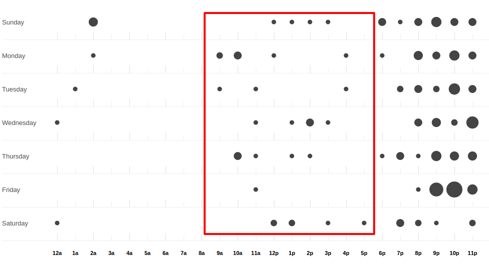
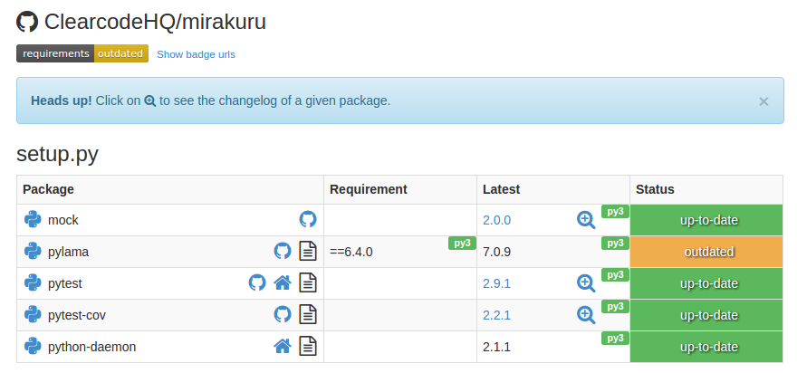

:title: Mirakuru - czy można robić open source w ramach komercyjnych projektów?
:data-transition-duration: 1000
:css: base.css
:skip-help: true

----

Mirakuru
========
Czy można robić open source w ramach komercyjnych projektów?
------------------------------------------------------------

----

Paweł Wilczyński, Grzegorz Śliwiński
-------------------------------------
@ Clearcode
------------

----

----

Co to robi i dlaczego uprości ci życie?
=======================================

----

.. code-block:: python

    from mirakuru import SimpleExecutor

    process = SimpleExecutor('/usr/local/bin/ntpd')
    process.start()

    # Do your stuff

    process.stop()

.. note::

    * SimpleExecutor nie czeka na start procesu

----

.. code-block:: python
    
    from mirakuru import OutputExecutor

    process = OutputExecutor(
        'processing.py',
        banner='started!'
    )
    process.start()  # Blocks until the process is started

    # Do your stuff

    process.stop()

----

.. code-block:: python

    from mirakuru import TCPExecutor

    process = TCPExecutor(
        'redis-server',
        host='localhost',
        port=1234
    )
    process.start()

    # Do your stuff

    process.stop()

----

.. code-block:: python

    from mirakuru import HTTPExecutor

    process = HTTPExecutor(
        'web_app.py',
        url='http://localhost:6543/status'
    )
    process.start()

    # Do your stuff

    process.stop()

----

.. code-block:: python

    from mirakuru import HTTPExecutor

    proc = HTTPExecutor(
        'my_special_process',
        url='http://localhost:6543/status'
    )
    with proc:
        # Do your stuff
        assert proc.running() is True

    assert proc.running() is False

----

.. code-block:: python

    """
    :param (str, list) command: command to be run by the subprocess
    :param bool shell: same as the `subprocess.Popen` shell definition
    :param int timeout: number of seconds to wait for the process to start
        or stop. If None or False, wait indefinitely.
    :param float sleep: how often to check for start/stop condition
    :param int sig_stop: signal used to stop process run by the executor.
        default is `signal.SIGTERM`
    :param int sig_kill: signal used to kill process run by the executor.
        default is `signal.SIGKILL`
    """

----

Skąd się wzięło?
================

.. note::

    Grzegorz

----

summon_process
==============

* Mateusz Lenik
* wroc.py #3

.. note::

    * Lipiec/Sierpień 2013,
    * krótko potem zaprzągliśmy do naszych testów

----

Kontrybuowanie do summon_process
================================

* długi czas reakcji
* testy...
* contextmanager? orchestrated!

.. note::

    * zamiast prostych context managerów, **orchestrated**, z klasą Orchestration
    * Orchestration - to technika służąca rozdieleniu logicznemu zależnych od siebie aplikacji,
        coś a'la dyrygent, który zawiaduje procesami wykonując odpowiednie akcje na sekcjach orkiestry
    * Każdy, kto musiałby użyć tego podejscia i napisać Orchestratora,
        musiałby i tak użyć swojego kontekst managera
    * O ile w ogólnym sensie może się przydać, tutaj - zbyt duże narzędzie. Tylko start i stop.
        Na sztywno zaszyte w orchestrated.

----

Forkujemy
=========

.. image:: fork.png
    :align: center

.. note::

    * testy
    * dokumentacja
    * chęć ułożenia api jak chcemy...
    * zachowujemy historię!

----

rozwój - w pracy
================

----

rozwój - w domu
===============

.. note::

    * na początek - euforia - jak najszybciej do releasu

----

nazwa - mirakuru
================

.. note::

    * 2 sezon serialu Arrow:
    * Główny antagonista - Deathstroke/Slade Wilson (Deadpool - Wade Wilson)
        * Pod wpływem mirakuru, Japońskiego serum nadczłowieka z czasów WWII
    * skutki mirakuru
        * nadludzka siła,
        * regenracja...
        * ale także agresywność, halucynacje i chęć mordestwa.
    * Z tego względu właśnie nazwa wydawała się odpowiednia:
        * nadludzka siła, sterowanie zewnętrznymi usługami: baza danych, aplikacja.
        * jeśli jednak popełnimy błąd, albo pojawi się jakis problem:
            * procesy mogą wyciec,
            * możemy wysycić zasoby

----

czy nazwa jest dobra?
=====================

----

Wspierane wersje, systemy
=========================

* python 2.7, 3.3, 3.4, 3.5
* pypy, pypy3
* linux, osx

.. note::

    * niedawno porzuciliśmy wsparcie dla pythona 3.2
    * wsparcie dla osx jest częściowe (paweł opowie później)

----

compat.py & żadnych zależności... ?
===================================

.. code-block:: python

    import sys

    python = sys.executable

    if sys.version_info.major == 2:
        from httplib import HTTPConnection, HTTPException, OK
        from urlparse import urlparse
    else:
        # In Python 3 httplib is renamed to http.client
        from http.client import HTTPConnection, HTTPException, OK
        # In Python 3 urlparse is renamed to urllib.parse
        from urllib.parse import urlparse

.. note::

    * pomysł zaczerpnięty z pyramida
    * istnieje six, ale aż takiej logiki nie potrzebowaliśmy

----

zależności! ale tylko testowe
=============================

.. code-block:: python

    tests_require = (
        'pytest',  # tests framework used
        'pytest-cov',  # coverage reports to verify tests quality
        'mock',  # tests mocking tool
        'python-daemon',  # used in test for easy creation of daemons
        'pylama==6.4.0',  # code linters
    )

.. note::

    Grzegorz

----

Testy
=====

* .. image:: pytest1.png

* coverage.py
* .. image:: travis.png
* .. image:: coveralls.png
    :width: 150
    :height: 150

.. note::

    * py.test - nasz domyślny wybór jeśli chodzi o framework testowy
    * we wszystkich naszych paczkach mierzymy pokrycie kody testami,
        co i tak nie chroni nas od błędów
    * każdy pull-request jest odpalany na travisie w każdej wersji pythona na linuksie
        * dodatkowo w pythonie 3.5 na osx
    * coveralls.io - raportuje pokrycie kodu i każdą zmianę na bierząco, również w pull requeście

----

Styl i jakość kodu
==================

* dokument CONTRIBUTE z opisem
* konkretne wymagania dotyczące stylu
* code review

.. note::

    * ale pilnowanie w code-review...
    * docstringi, zgodność z pep8
    * w code review nie zawsze wszystko jesteśmy w stanie wyłapać, jeśli chodzi o styl

----

Lintery? Enter pylama!
=======================

* Automatyzuje żmudne zadanie sprawdzania stylu kodowania
* pylama.ini - czarno na bialym spisane wymagania co do stylu kodowania
* pep8, pep257, mccabe, pyflakes - OUT of the box!

.. note::

    * Można powiedzieć, że wprowadza orchestracje linterów
    * łatwość pisania pluginów z innymi linterami (pylint, gjslint dla javascript)
    * Istnienie pliku konfiguracyjnego pozwala określić jakiś początkowy zakres wymagań i powoli,
        pojedynczo wprowadzać kolejne

----

.. code-block:: ini
    
    [pylama]
    linters = pep8,pyflakes,mccabe,pep257
    skip = docs/*,build/*,venv/*
    ignore = D203

    [pylama:pep8]
    max_line_length = 80

----

QuantifiedCode & Landscape
==========================

* Automatycznie sprawdzają kod pod wzgledem dobrych praktyk
* QuantifiedCode - 13 smrodków
* Landscape - 1 smrodek, 100% jakości ;)

.. note::

    * Na chwilę obecną obecność obu tych usług traktuję jako eksperyment
    * QuantifiedCode - Postanowiłem sprawdzić po wysłuchaniu podcasta "Talk Python To Me" z jednym z twórców.
    * Landscape - nawet nie wiem kto podpiął

----

QuantifiedCode
==============

* 5 głownych grup
* Konfigurowalny
* rozszerzalny
* autofix!

.. note::

    * Poprawność, utrzymanie, wydajność, czytelność i bezpieczeństwo
    * Pozwala wyłączyć niektóre smrodki spośród tych, które będzie sprawdzać, ale również w drugą stronę, pozwala zdefiniować własne.
    * posiada zdefiniowane smrodki specjalnie pod wybrane frameworki (Django, Flask, Plone, Odoo)
    * dla niektórych smrodków potrafi sam stworzyć pull request

----

Requires.io
===========

* obserwuje czy zależności są na czasie
* pull-request - jeśli są stare zależności

.. note::

    * pozwala to przetestować kod z konkretną wersją jakiejś zależności i automatycznie zostać
        poinformowanym o nowej wersji, i łącznie z wynikiem testów (travis-ci) dać informację,
        czy nasz kod jest zgodny, czy nie
    * będziemy testować z przypinaniem pylamy

----

Statystyki
==========

* 210 commitów
* 11 wydań
* 8 kontrybutorów
* 19 zamkniętych ticketów
* Python 100.0%
* 100% kodu pokrytego przez testy
* 979 linii kodu
* 789 linii testów
* 1494 pozostałych linii (dokumentacja etc.)

----

Licencja
========

GNU LESSER GENERAL PUBLIC LICENSE
---------------------------------

.. note::
    
    Wykorzystanie Lesser GPL dopuszcza korzystanie z biblioteki w programach prawnie zastrzeżonych.
    Zastosowanie zwykłej GPL powoduje, że biblioteka jest dostępna tylko dla wolnych programów.

----

Zastosowanie mirakuru
=====================

* pytest-dbfixtures

.. code-block:: python

    def test_using_two_redis(redisdb, redisdb2):
        redisdb.set('woof1', 'woof1')
        redisdb2.set('woof2', 'woof12')

        
----

* testy integracyjne

.. code-block:: python

    from mirakuru import Executor

    class UnixSocketExecutor(Executor):

        def __init__(self, command, socket, shell=False,
                     timeout=None, sleep=0.1):
            """Extend `mirakuru.HTTPExecutor` to store Unix socket path.

            :param str socket: Unix socket path
            """
            super(UnixSocketExecutor, self) \
                .__init__(command, shell, timeout, sleep)
            self.socket = socket

        def pre_start_check(self):
            """Check that the Unix socket file doesn't exist."""
            return Path(self.socket).exists()

        def after_start_check(self):
            """Check that the Unix socket file exist."""
            return self.pre_start_check()

        def stop(self):
            """Delete the socket file after stopping the service."""
            super(UnixSocketExecutor, self).stop()
            Path(self.socket).remove_p()

            
----

Problemy
========

- OSX
- Wyciekanie podprocesów

    * daemons
    * ctrl + C
    * kill -9

----

To the future
=============

* mirakuru jako narzędzie linii komend

.. code-block:: bash
    
    $ mirakuru tcp 127.0.0.1 5000 \
      -- ./fancy_command.sh

    $ mirakuru tcp 127.0.0.1 5000 --timeout=20 \
      --sig_stop='SIGKILL' -- ./fancy_command.sh

    $ mirakuru http http://127.0.0.1:5000/check \
      --shell=ture -- ./fancy_command -a "abc"

    $ mirakuru out "has started." \
      -- ./fancy_command -a "abc"

    $ mirakuru pid /var/fancy_process/run.pid \
      --timeout=100 -- ./fancy_command -a "abc"

----

Inne rozwiązania
================

* subprocess

    * call
    * check_call
    * check_output
    * Popen

* subprocess32 (timeout)

----

Inne rozwiązania
================
* EasyProcess

.. code-block:: python

    >>> from easyprocess import EasyProcess
    >>> EasyProcess('python --version').call().stderr
    u'Python 2.7.11'

* spawn_and_check

.. code-block:: python

    from spawn_and_check import execute, check_http
    process = execute(
        'run_some_service --port 8000',
        [check_http('http://127.0.0.1:8000')],
        timeout=10,
    )

----

Biblioteki OpenSource naszego zespołu
=====================================

* mirakuru
* pytest-dbfixtures
* pytest-repeater
* matchbox
* ianitor

----

Bibliografia
============

* `mirakuru <https://pypi.python.org/pypi/mirakuru/>`_
* `summon_process <https://github.com/mlen/summon_process>`_
* `Orchestration <https://www.mulesoft.com/resources/esb/what-application-orchestration>`_
* `Mirakuru (Arrow TV Series) <http://arrow.wikia.com/wiki/Mirakuru>`_
* `pylama linters <https://pypi.python.org/pypi/pylama/>`_
* `Travis Continous Integration <http://travis-ci.org/>`_
* `coveralls.io (code coverage tool) <http://coveralls.io/>`_
* `QuantifiedCode <https://www.quantifiedcode.com/>`_
* `Hovercraft rst presentations <http://hovercraft.readthedocs.org/>`_

----

Mirakuru
========
Czy można robić open source w ramach komercyjnych projektów?
------------------------------------------------------------
